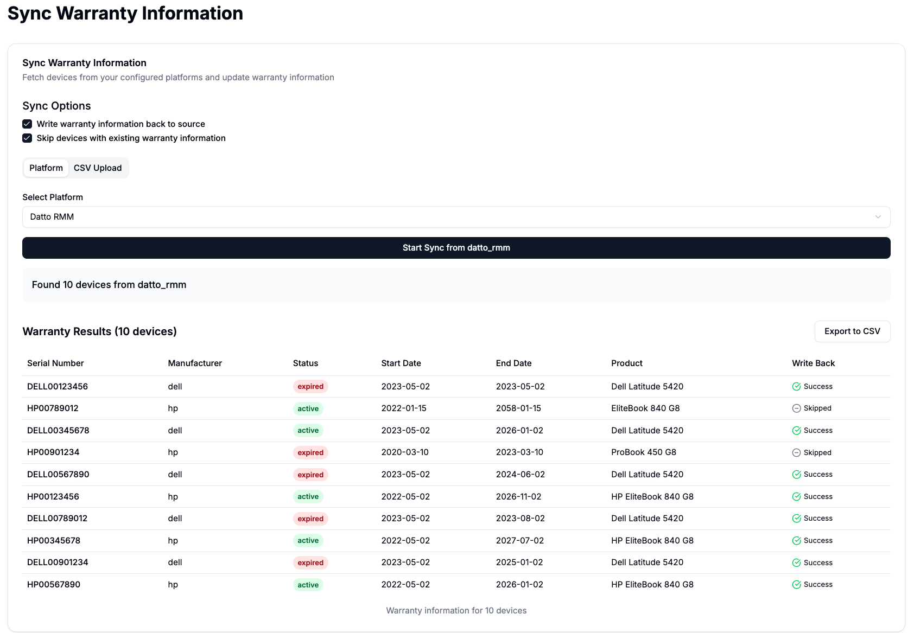

# Warranty Watcher

A warranty information management system that bridges the gap between IT management platforms and manufacturer warranty databases. This system democratizes warranty lookups, making it accessible and transparent for IT professionals and managed service providers (MSPs).

A demo with mock data:



## Features

- **Multi-Platform Integration:** Connect to various IT management platforms to retrieve device information
- **Manufacturer API Integration:** Query multiple manufacturer warranty APIs to determine warranty status
- **Local Storage:** All configuration is stored in the browser's local storage for privacy
- **CSV Import:** Import device information via CSV file
- **Reporting:** Generate and export warranty status reports

## Supported Platforms

- **PSA Tools**
  - ⏳ None yet (future support planned)

- **RMM Platforms**
  - 🚧 Datto RMM (work in progress)
  - 🚧 N-able N-central (work in progress)

- **Other**
  - 🚧 CSV Files (for standalone reporting)

## Supported Manufacturers

- 🚧 Dell (work in progress)
- 🚧 HP (work in progress)
- ⏳ Lenovo (planned)
- ⏳ Microsoft (planned)
- ⏳ Apple (planned)


## Getting Started

### Prerequisites

- Node.js 18.0.0 or later

### Installation

1. Clone the repository
   ```
   git clone https://github.com/yourusername/warranty-watcher.git
   cd warranty-watcher
   ```

2. Install dependencies
   ```
   npm install
   ```

3. Run the development server
   ```
   npm run dev
   ```

4. Open [http://localhost:3000](http://localhost:3000) in your browser

## Usage

1. Configure manufacturer API credentials (Dell, HP, etc.)
2. Configure platform credentials (Datto RMM)
3. Sync devices from your platform or upload a CSV file. 
4. View and export warranty information. You can choose to write the warranty info back to the source platform (RMM / PSA)
